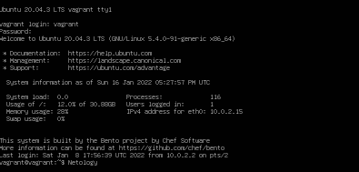

1. `cd` - внутренняя (встроенная) команда:
   ```
   vagrant@vagrant:~$ type cd
   cd is a shell builtin
   ```
   Внутренние команды выполняются быстрее, а так же внутренние команды имеют прямой доступ к внутренним структурам командного интерпретатора.

   Команда `cd` могла бы быть внешней, но тогда ёе выполнение порождало бы дочерний процесс.
2. `grep <some_string> <some_file> -с`
3. `systemd` - родительский процесс с PID 1:
   ```
   vagrant@vagrant:~$ pstree -p
   systemd(1)─┬─VBoxService(898)─┬─{VBoxService}(901)
           │                  ├─{VBoxService}(902)
           │                  ├─{VBoxService}(907)
           │                  ├─{VBoxService}(908)
           │                  ├─{VBoxService}(909)
   ```
4. ```
   vagrant@vagrant:~$ tty
   /dev/pts/0
   vagrant@vagrant:~$ ls qwe.txt 2>/dev/pts/1
   ```
   Во второй консоли:
   ```
   vagrant@vagrant:~$ tty
   /dev/pts/1
   vagrant@vagrant:~$ ls: cannot access 'qwe.txt': No such file or directory
   ```
5. Да, получится, напрмиер:
   создадим файл test.txt:
   ```
   vagrant@vagrant:~$ cat test.txt
   qwe
   test
   qwe
   asd
   qwe
   ```
   Тогда вызов команды: `cat <test.txt 1>test_out.txt` (или `cat < test.txt > test_out.txt`) принимает test.txt в качестве stdin и выводид stdout в файл test_out.txt:
   ```
   vagrant@vagrant:~$ cat test_out.txt
   qwe
   test
   qwe
   asd
   qwe
   ```
6. Да, получится. Для этого в PTY выполняем:
   ```
   vagrant@vagrant:~$ echo Netology > /dev/tty1
   ```
   
7. `bash 5>&1` - создаёт дескриптор 5 и перенапрявляет его в дескриптор 1 (stdout), то есть `echo netology > /proc/$$/fd/5` просто выведет строку `netology` в stdout:
   ```
   vagrant@vagrant:~$ bash 5>&1
   vagrant@vagrant:~$ echo netology > /proc/$$/fd/5
   netology
   ```
8. `ls qwe.txt 4>&2 2>&1 1>&4 | grep 'file'` - новый дескриптор 4 - перенаправляем в stderr, stderr перенапрявляем в stdout и stdout перенаправляем в новый дескриптор 4:
   ```
   vagrant@vagrant:~$ ls qwe.txt 4>&2 2>&1 1>&4 | grep 'file'
   ls: cannot access 'qwe.txt': No such file or directory
   ```
9. `cat /proc/$$/environ` - выводит переменные окружения. Аналогичный по содержанию вывод можно получить с помощью команды `printenv` или `env`.
10. `/proc/<PID>/cmdline` - файл, доступный только для чтения, содержит полный путь до исполняемого файла процесса <PID> (если это не зомби процесс).
    
    `/proc/<PID>/exe` - символическая ссылка, содержащая путь к запущенному процессу <PID>.
11. `cat /proc/cpuinfo | grep sse` -> sse4_2 (SSE4.2)
12. По умолчанию при запуске ssh на удалённом компьютере для удалённого сеанса не выделяется TTY. Можно использовать флаг `-t` для принудительного 'выделения' TTY (Force pseudo-terminal allocation)
    ```
    vagrant@vagrant:~$ ssh -t localhost 'tty'
    vagrant@localhost's password:
    /dev/pts/1
    Connection to localhost closed.
    ```
13. ```
    vagrant@vagrant:~$ nano test.txt
    # press Ctrl+X
    vagrant@vagrant:~$ bg
    [1]+ nano test.txt &
    [1]+  Stopped                 nano test.txt
    
    vagrant@vagrant:~$ ps -elf | grep nano
    0 T vagrant    16793   16181  0  80   0 -  2208 do_sig 21:13 pts/0    00:00:00 nano test.txt
    0 S vagrant    16797   16181  0  80   0 -  2040 pipe_w 21:16 pts/0    00:00:00 grep --color=auto nano
    
    # PID = 16793
    vagrant@vagrant:~$ disown 16793
    bash: warning: deleting stopped job 1 with process group 16793
    
    vagrant@vagrant:~$ sudo nano /etc/sysctl.d/10-ptrace.conf
    # change kernel.yama.ptrace_scope = 1 to 0 value
    vagrant@vagrant:~$ sudo sysctl --system

    vagrant@vagrant:~$ screen
    vagrant@vagrant:~$ reptyr 16793
    ```
14. `tee` — читает значение из stdin и записывает его как в stdout, так и в один или несколько файлов.
    Поскольку `tee` запускается с `sudo`, команда имеет права на запись в файл `/root/new_file`.